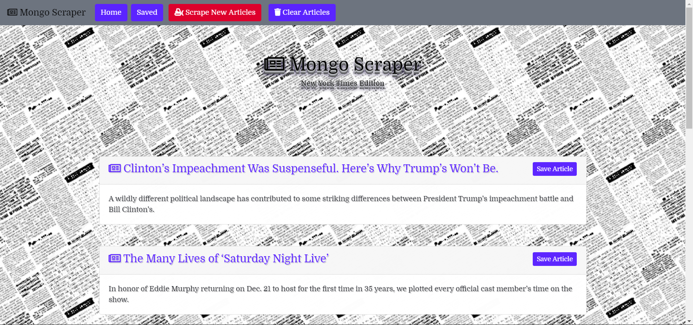

# [MongoDB-Scraper](https://stark-dusk-28801.herokuapp.com/)
___


Welcome to **MongoDB-Scraper**. 

This is a JavaScript App that scrapes the New York Times website for data. The app allows the user to scrape the latest headlines into a database. The user can then save selected articles to another database and add comments. If articles were already saved, the user can see the all the comments left by other users. This app is currently deployed to Heroku.
# Instructions
1. Fork or clone this repo.
```
git clone git@github.com:armonkahil/MongoDB-Scraper.git
```

2. Assuming that [Node.js](https://nodejs.org/en/) and [Mongodb](https://www.mongodb.com/) is already installed:
```
npm install
node server.js
```
---

# Technologies Used:
- [Cheerio](https://www.npmjs.com/package/cheerio)
- [Mongodb](https://www.mongodb.com/)
- [Node.js](https://nodejs.org/en/)
- [Mongoose](https://mongoosejs.com/)
- [Express](https://expressjs.com/)
- [Handlebars](https://handlebarsjs.com/)
- [Axios](https://www.npmjs.com/package/axios)
- [Bootstrap 4](https://getbootstrap.com/)
- [Gradient-string](https://www.npmjs.com/package/gradient-string)
- [Heroku](https://www.heroku.com)
- [Travis CI](https://www.travis-ci.com)
- [ESlint](https://eslint.org/)
- [Chai](https://www.chaijs.com/)
- [MVC](https://en.wikipedia.org/wiki/Model%E2%80%93view%E2%80%93controller)

## Live Demo
